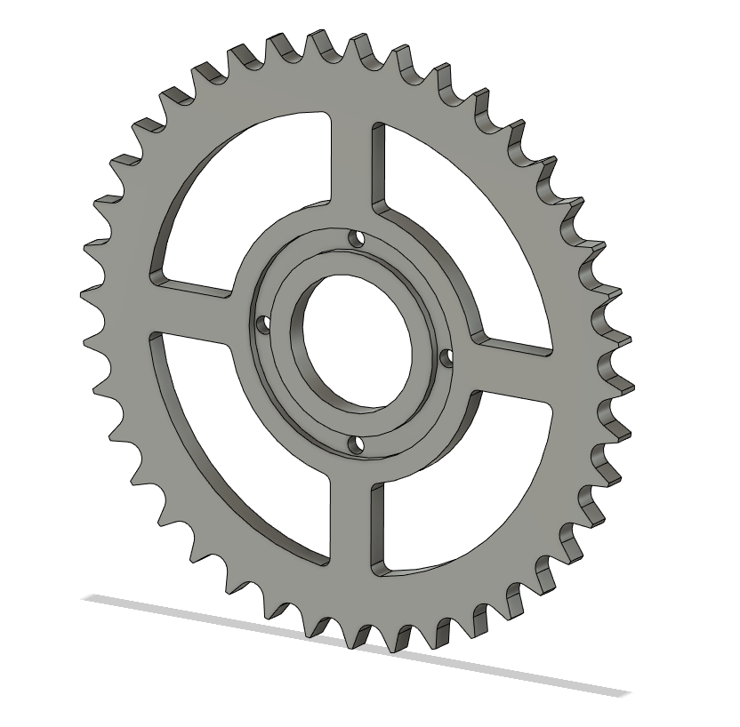
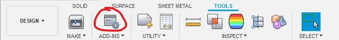
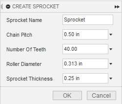

# Sprocket Generator

A python script for Autodesk Fusion 360 that will create a sprocket used for roller chains based off the chain pitch, roller diameter, and the number of teeth on the sprocket.

Originally based off [Designing and Drawing a Sprocket](http://www.gearseds.com/files/design_draw_sprocket_5.pdf), but switched to [Instructables How to Draw a Sprocket Gear](https://www.instructables.com/id/How-to-Draw-a-Sprocket-Gear/).

# How to use

Clone or download this project

Open the Scripts and Add-Ins menu in Fusion.

Click on the green plus sign next to 'My Script'. A file dialogue will appear. Select the sprocket_generator folder.

When run, there will be a dialogue box asking for the parameters.

Note: Not all combinations of values work.

Pressing OK will generate the sprocket